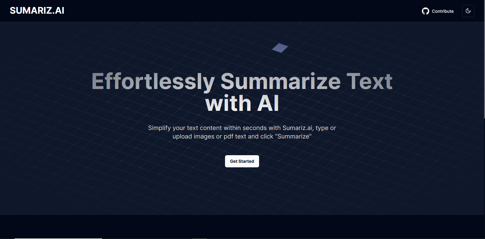

# Sumariz.ai

This Next.js-based AI Summarization Tool incorporates Tesseract for image-to-text conversion. It enables users to summarize text content efficiently or extract text from images for quick comprehension of large amounts of information.

## Features

- **Text Summarization**: Condenses lengthy text passages into concise summaries using advanced NLP techniques.
- **Image-to-Text Conversion**: Extracts text from images, making them editable.
- **User-friendly Interface**: Clean and intuitive UI for easy usage.
- **Next.js Framework**: Ensures high performance and scalability.

## Usage

### Text Summarization

1. Enter or paste text into the provided input area.
2. Click "Summarize" to generate a summarized version.

### Image-to-Text Conversion

1. Click "Upload Image" and select an image file.
2. Extracted text is displayed, editable as needed.

## Installation

1. Clone this repository.
2. Install dependencies.
3. Start the development server.
4. Visit `http://localhost:3000`.

## Contributing

Contributions are welcome! Follow project guidelines and submit a pull request.

## License

This project is licensed under the [MIT License](LICENSE).

## Support

For questions or issues, [open an issue](https://github.com/your-username/ai-summarization-tool/issues) on GitHub.